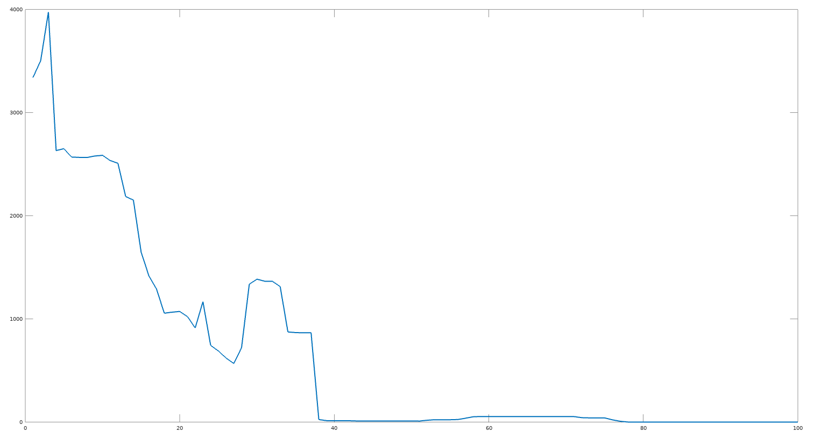

# octave

* matlab and [GNU Octave plotting](https://www.gnu.org/software/octave/)



1. Number of files modified by image build process

# Machine Learning

Most popular prototyping languages are

1. octave
2. matlab
3. python
4. numpy
5. R

## Learning octave

* Follow through common terminal matrix operations
* Plot trignometric functions
* Countour plots for polynomials and gradients
* Chaining multiple commands
* [Vectorization - SIMD operations](https://octave.org/doc/interpreter/Vectorization-and-Faster-Code-Execution.html#Vectorization-and-Faster-Code-Execution)
* Differential Equations
* 3D plotts and meshes


```
who
whos
save hello.mat vector1 -ascii
load hello.mat

hold on
subplot
[imagesc](https://octave.sourceforge.io/octave/function/imagesc.html) - scaled version of image
colormap (prism(10))
```

### Related work

- http://www.sharetechnote.com/html/Octave_Matlab_PlotApplication.html
- 